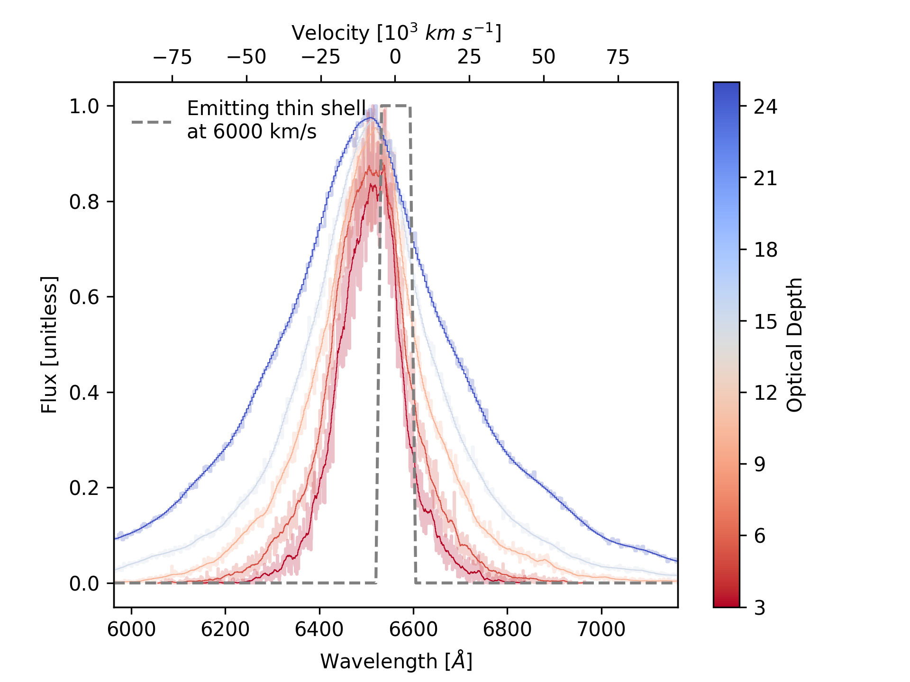
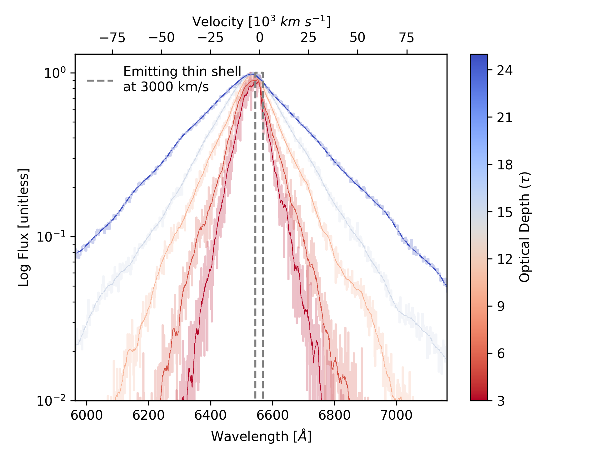

[arxiv_link]: https://arxiv.org/abs/2312.13280
[arxiv_link_SN2023fyq]: https://arxiv.org/abs/2401.15148

# eScatter.py - Electron Scattering in Python

*eScatter.py* is a Monte Carlo Electron Scattering code designed to perform Monte Carlo simulations of electron scattering events. The baisi of this code originates from [Pozdnyakov et al. 1983](https://ui.adsabs.harvard.edu/abs/1983ASPRv...2..189P/abstract), with similar codes developed for interacting supernovae such as [SN 2010jl](https://arxiv.org/abs/1312.6617) and [SN 2013L](https://arxiv.org/abs/2003.09709).

This code was developed to better understand the emission lines from the interacting supernova, [SN 2021adxl][arxiv_link] and [SN 2023fyq][arxiv_link_SN2023fyq], specifically the blue excess seen in the H&alpha; 6563A and He I 5876 emission lines respectively.


> [!NOTE]
> The code is under active development with an accompanying paper in preparation - Please direct any questions to [me](mailto:sean.brennan@astro.su.se).

## Toy Model

This code was built to model the interaction of fast-moving ejecta produced in a supernova explosion colliding with slow-moving material (see [Section 4 in our paper][arxiv_link]).

In short, this code will follow a photon, which was formed in a thin interface between the supernova ejecta and surrounding material, as it travels radially outwards through the dense material (described by a given optical depth, &tau;). As the photon travels outwards through this material, it will scatter off an electron with a certain energy (related to its Maxwellian velocity). The photon will then undergo probabilistic iterations and may (or may not) scatter off the electron.

<p align="center">
  
  <br>
  <em>Figure 1: An example of *eScatter.py*'s output for the H&alpha; emission line. Here an input profile similar to a thin emitting shell traveling at 3000 km/s is used. Photons are allowed to travel through a medium with a varying optical depth. Generally, with higher optical depth, the emergent profile is broader, and the peak moves towards the blue. See <a href="https://arxiv.org/abs/2312.13280">here</a> to see how we fit this to an observed H&alpha; profile.</em>
</p>

The photon will continue to scatter outwards until it reaches an optically thin region, far away from where it was formed. We assume that photons emitted (or more accurately the photons which escape) on a single hemisphere are observed (i.e., photons which escape and are traveling away from the observer are not seen). A histogram of the emergent photons is then taken to be the emergent spectral profile.

<p align="center">
  
  <br>
  <em>Figure 2: Same as Figure 1 but in logspace. Note the similarity to the work done by <a href="https://arxiv.org/abs/1312.6617">Huang & Chevalier 2017</a>.</em>
</p>

> [!CAUTION]
> Understand the output of the code before applying models to data. This code is not meant to be used as a black box, and the output of this code should be complemented with other information, such as the evolution of the transient and the appearance of scattering features in emission profiles.

Although scattering can produce very broad profiles when you assume high optical depths, you have to account for diffusion times, i.e., has a transient evolved for long enough for such photons to diffuse to optically thin regions. Typically, Type IIn SNe will show such features post-peak (after a few weeks post-explosion), constraining the optical depth.

The diffusion time for a photon traveling through a medium with a certain optical depth, and assuming a random walk, is given by the following equation:

$$ t_d = \frac{R^2 \tau}{c} $$

where:
- \( t_d \) is the diffusion time,
- \( R \) is the characteristic length scale of the medium,
- \( &tau; \) is the optical depth of the medium,
- \( c \) is the speed of light in a vacuum.


## Usage

This version of escatter.py is executed by changing values in the script and running the file. Below is a snippet of the parameters, many of these can be made into lists to build a grid of models.

```python
# Rest wavelength in units of Angstrom
lam_0 = 6563

# Density parameter either 0 or 2 [0 untested]
s = [2]

# Number of photons to send out
nPhotons = 1e5

# Optical depth (can be a list)
tau_range = [3, 5, 10, 15, 25]

# Electron temperature from just above formation site to edge of boundary
Te_range = [(2e4, 1e4)]

# Inner and outer radius of scattering region (this doesn't change the profile too much)
R_range = [(1e14, 1.01e14)]

# Wind velocity (untested)
vwind = [40]  # km/s

# Shock velocity in km/s
vsh = [3000]
```

The above parameters produced the output used in Figure 1. Once you have input your parameters, run the script using:

```bash
python escatter.py
```

Figures and output txt files will be written to `output/` and `figures/`.

## Limitations

There are many limitations and caveats to using this code:

- The code is completely spherically symmetric - such asymmetric features such as torus or jets, in reality, may yield different results.
- Several functions are hardcoded, such as how and where the photons are injected, and how the CSM density and temperature evolve. This is a limitation of the code.
- The code does not include absorption (i.e., the profile cannot produce P-Cygni-like profiles) - **under development**.

## Requirements

```
matplotlib==3.8.0
numpy==1.26.2
tqdm==4.66.1
```

## Citation

Dedicated paper in progress. For the time being please cite:

```
@software{2024ascl.soft01020B,
       author = {{Brennan}, S.~J. and {Schulze}, S. and {Lunnan}, R. and {Sollerman}, J. and {Yan}, L. and {Fransson}, C. and {Irani}, I. and {Melinder}, J. and {Chen}, T.~W. and {De}, K. and {Fremling}, C. and {Kim}, Y.~L. and {Perley}, D. and {Pessi}, P.~J. and {Drake}, A.~J. and {Graham}, M.~J. and {Laher}, R.~R. and {Masci}, F.~J. and {Purdum}, J. and {Rodriguez}, H.},
        title = "{escatter: Electron scattering in Python}",
 howpublished = {Astrophysics Source Code Library, record ascl:2401.020},
         year = 2024,
        month = jan,
          eid = {ascl:2401.020},
       adsurl = {https://ui.adsabs.harvard.edu/abs/2024ascl.soft01020B},
      adsnote = {Provided by the SAO/NASA Astrophysics Data System}
}
```

## Warning

I make no claim as to the validity of the output of this code; use it at your own discretion.
