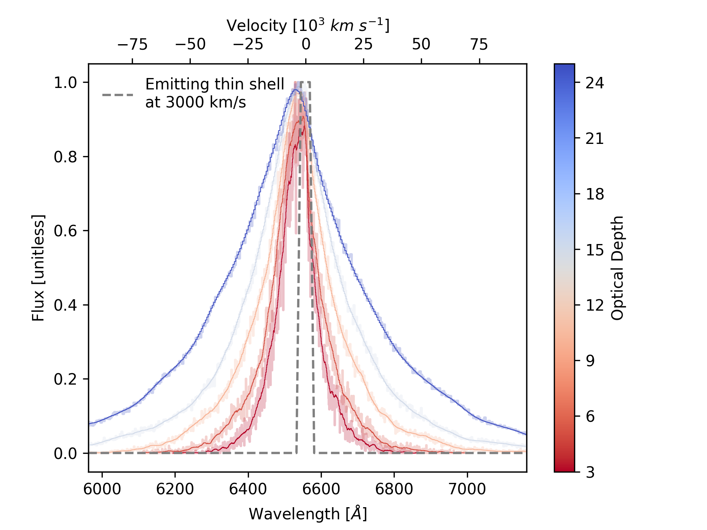

[arxiv_link]: https://arxiv.org/abs/2312.13280
[arxiv_link_SN2023fyq]: https://arxiv.org/abs/2401.15148


<div align="center">
  <h4>The Concept</h4>
</div>

**eScatter.py** is a Monte Carlo electron scattering code designed to perform simulations of electron scattering events. The foundation of this code originates from [Pozdnyakov et al. 1983](https://ui.adsabs.harvard.edu/abs/1983ASPRv...2..189P/abstract), with similar applications developed for interacting supernovae, such as [SN 2010jl](https://arxiv.org/abs/1312.6617) and [SN 2013L](https://arxiv.org/abs/2003.09709).

The development of this code aims to improve our understanding of emission lines from interacting supernovae like [SN 2021adxl][arxiv_link] and [SN 2023fyq][arxiv_link_SN2023fyq], particularly the blue excess observed in the H&alpha; 6563&Aring; and He I 5875&lambda; emission lines.

> [!NOTE]  
> The code is under active development, with an accompanying paper in preparation. Future improvements will include bound-bound, bound-free, and free-free transitions, as well as the incorporation of viewing angle effects, which will be integrated into the <span style="font-variant: small-caps;">SOLAS</span> code. Please direct any questions to [me](mailto:sean.brennan@astro.su.se).

<div align="center">
  <h4>Toy Model</h4>
</div>

This code models the interaction of fast-moving ejecta produced in a supernova explosion colliding with slow-moving material (see [Section 4 in our paper][arxiv_link]).

In brief, the code tracks a photon formed in the thin interface between supernova ejecta and surrounding material as it moves radially outwards through dense material (characterized by a given optical depth, &tau;). As it travels, the photon may scatter off an electron with energy related to its Maxwellian velocity (which depends on its temperature). The photon then undergoes probabilistic iterations, with the possibility of further scattering events.

<p align="center">
  
  <br>
  <em>Figure 1: An example of *eScatter.py*'s output for the H&alpha; emission line. Here, an input profile resembling a thin emitting shell traveling at 3000 km/s is used. Photons are allowed to travel through a medium with varying optical depths. Generally, higher optical depth broadens the emergent profile and shifts the peak towards the blue. See <a href="https://arxiv.org/abs/2312.13280">here</a> for how we fit this to an observed H&alpha; profile.</em>
</p>

The photon continues to scatter outwards until it reaches an optically thin region. Only photons escaping in the observer's hemisphere are considered visible. A histogram of these emergent photons forms the spectral profile.

<p align="center">
  
  <br>
  <em>Figure 2: Same as Figure 1, but in logarithmic space. Note the similarity to the work by <a href="https://arxiv.org/abs/1312.6617">Huang & Chevalier 2017</a>.</em>
</p>

> [!CAUTION]  
> Understand the output of the code before applying models to data. This code is not meant to be used as a black box. The output should be complemented with other information, such as the transient’s evolution and the appearance of scattering features in emission profiles.

Although high optical depths may produce broad profiles, diffusion times must be considered. Typically, Type IIn SNe display such features post-peak, a few weeks after the explosion, constraining the optical depth.

The diffusion time for a photon traveling through a medium with optical depth &tau; is given by the equation:

$$ t_d = \frac{R \tau}{c} $$

where:
- \( t_d \) is the diffusion time,
- \( R \) is the characteristic length scale of the medium,
- \( \tau \) is the optical depth of the medium,
- \( c \) is the speed of light.

<div align="center">
  <h4>Usage</h4>
</div>

This version of *eScatter.py* can be executed by modifying parameters in the script and running the file. Below is a parameter snippet, which can be expanded into lists to generate a model grid.

```python
# Rest wavelength in Angstroms
lam_0 = 6563

# Density parameter typically between 0 (Shell-like CSM) and 2 (Wind-like CSM)
s = [2]

# Number of photons to simulate
nPhotons = 1e5

# Optical depth (can be a list)
tau_range = [3, 5, 10, 15, 25]

# Electron temperature from formation site to boundary edge
Te_range = [(2e4, 1e4)]

# Inner and outer radius of scattering region (minimal effect on profile)
R_range = [(1e14, 1.01e14)]

# Wind velocity (untested)
vwind = [40]  # km/s

# Shock velocity in km/s
vsh = [3000]

```

The above parameters produced the output used in Figure 1. Once you have input your parameters, run the script using:

```bash
python escatter.py
```

Figures and output txt files will be written to `output/` and `figures/`.


<div align="center">
  <h4>Limitations</h4>
</div>
This is a Toy model. There are many limitations and caveats to using this code:

- The code is completely spherically symmetric - such asymmetric features such as torus or jets, in reality, may yield different results.
- Several functions are hardcoded, such as how and where the photons are injected, and how the CSM density and temperature evolve. This is a limitation of the code.
- The code does not include absorption (i.e., the profile cannot produce P-Cygni-like profiles) - **under development**.


<div align="center">
  <h4>Using this code</h4>
</div>

> [!CAUTION]  
> I make no claim as to the validity of the output of this code; use it at your own discretion.

Dedicated paper in progress. For the time being please cite:

```
@software{2024ascl.soft01020B,
       author = {{Brennan}, S.~J. and {Schulze}, S. and {Lunnan}, R. and {Sollerman}, J. and {Yan}, L. and {Fransson}, C. and {Irani}, I. and {Melinder}, J. and {Chen}, T.~W. and {De}, K. and {Fremling}, C. and {Kim}, Y.~L. and {Perley}, D. and {Pessi}, P.~J. and {Drake}, A.~J. and {Graham}, M.~J. and {Laher}, R.~R. and {Masci}, F.~J. and {Purdum}, J. and {Rodriguez}, H.},
        title = "{escatter: Electron scattering in Python}",
 howpublished = {Astrophysics Source Code Library, record ascl:2401.020},
         year = 2024,
        month = jan,
          eid = {ascl:2401.020},
       adsurl = {https://ui.adsabs.harvard.edu/abs/2024ascl.soft01020B},
      adsnote = {Provided by the SAO/NASA Astrophysics Data System}
}
```
